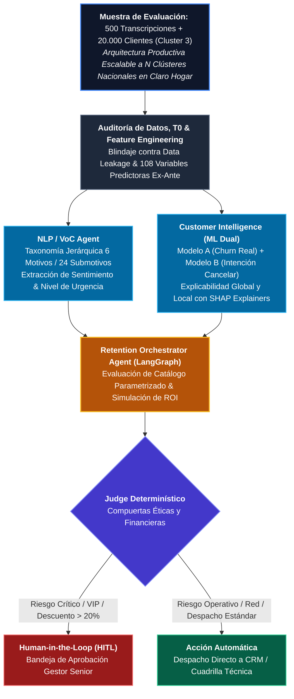

# Claro Colombia — Orquestador de Agentes de IA & Machine Learning

[](https://www.python.org/downloads/)
[]()
[]()
[]()

> **Prueba Técnica de Selección:** Orquestador de Agentes de IA / Machine Learning  
> **Candidato:** Neydher Antonio Martin Ramos  
> **Evaluador / Liderazgo:** Rafael José Del Castillo Pavajeau — Gerencia de Analítica Avanzada, Claro Colombia  

---

## 1. Visión Ejecutiva y Propósito de Negocio

El **Cluster 3** representa el segmento de clientes residenciales más vulnerable a la deserción (*churn*) y deterioro de ingresos (*ARPU*) dentro de Claro Colombia. Este proyecto implementa una solución integral de grado de producción que orquesta modelos predictivos de Machine Learning, Procesamiento de Lenguaje Natural (NLP) sobre la Voz del Cliente y un sistema Multi-Agente con compuertas de supervisión humana (**Human-in-the-Loop - HITL**).



<details>
<summary><b>Ver Diagrama Arquitectónico en Formato Texto (ASCII Alineado)</b></summary>

```text
+-------------------------------------------------------------------------+
| Muestra de Evaluación: 500 Transcripciones + 20.000 Clientes (Cluster 3)|
| Arquitectura Productiva: Escalable a N Clústeres Nacionales en Claro    |
+------------------------------------+------------------------------------+
                                     |
                                     v
+-------------------------------------------------------------------------+
|              Auditoría de Datos, T0 & Feature Engineering               |
+------------------------------------+------------------------------------+
                                     |
                 +-------------------+-------------------+
                 |                                       |
                 v                                       v
+---------------------------------+     +---------------------------------+
|         NLP / VoC Agent         |     |      Customer Intelligence      |
|     (Motivo, Submotivo,         |     |    (LightGBM Churn/Intención    |
|      Sentimiento, Urgencia)     |     |     + SHAP Tree Explainers)     |
+----------------+----------------+     +----------------+----------------+
                 |                                       |
                 +-------------------+-------------------+
                                     |
                                     v
+-------------------------------------------------------------------------+
|                      Retention Orchestrator Agent                       |
|                     (Evaluación de Catálogo y ROI)                      |
+------------------------------------+------------------------------------+
                                     |
                 +-------------------+-------------------+
                 |                                       |
                 v                                       v
        [Riesgo Alto / VIP]                     [Riesgo Operativo]
                 |                                       |
                 v                                       v
         Human-in-the-Loop                       Acción Automática
        (Aprobación Humana)                     (Autogestión / Red)
```

</details>

### 1.1 Alcance del Assessment vs. Escalabilidad Nacional (N Clústeres)
* **Muestra de Evaluación (PoC)**: El ejercicio técnico entregado por Claro se acotó a una muestra representativa del **Cluster 3** (20.000 clientes residenciales y 500 llamadas transcritas).
* **Escalabilidad Horizontal ($N$ Clústeres)**: La solución **no está acoplada al Cluster 3**. La arquitectura fue diseñada para extenderse a toda la base nacional de Claro Hogar:
  1. **Taxonomía NLP Universal**: La taxonomía jerárquica (6 macro-motivos y 24 sub-motivos) cubre el 100% de las casuísticas de telecomunicaciones (Facturación, Red, Mudanza, Precio, Competencia, etc.) para cualquier clúster.
  2. **Modelos Predictivos Desacoplados**: El pipeline de entrenamiento y feature engineering soporta particionamiento multiclúster (`GROUP BY cluster_id`) o modelos globales con ponderación por segmento en PySpark / LightGBM.
  3. **Catálogo Parametrizado**: Las reglas de negocio, umbrales y costos están centralizados y parametrizados por clúster sin necesidad de modificar la lógica del motor agéntico.

### 1.2 Arquitectura Cloud de Despliegue en Producción (Azure Databricks Lakehouse)
El despliegue productivo está diseñado para operar sobre la plataforma corporativa de Claro Colombia (**Azure Databricks / Delta Lake**):
* **Capa Bronze**: Ingesta continua con **Databricks Auto Loader** desde Azure Data Lake Storage (ADLS Gen2) o AWS S3 para llamadas (transcripciones Speech-to-Text) y eventos de red (CDRs / telemetría).
* **Capa Silver**: Curaduría, limpieza de datos y feature store gobernada con **Delta Live Tables (DLT)** y **Unity Catalog**.
* **Capa Gold**: Scoring diario automatizado a las **02:00 AM** vía **Databricks Workflows** (Modelo A, Modelo B y valores SHAP) calculados en PySpark para millones de clientes.
* **Capa de Servicio de Agentes**: Microservicio **LangGraph + FastMCP** desplegado en contenedores sobre **Azure Kubernetes Service (AKS)** o **Databricks Model Serving**, integrado vía API con el CRM de Claro / Salesforce para disparar visitas técnicas o enrutar alertas a supervisores (HITL).
* **Monitoreo & LLMOps**: **MLflow Model Registry** y **Lakehouse Monitoring** para detección de deriva de datos (*Data Drift* / PSI), deriva conceptual (*Concept Drift*) y auditoría de decisiones agénticas.

---

## 2. Decisiones Arquitectónicas Fundamentales

1. **Restricción Crítica de Integración (No Cruce 1:1 Forzado):**
   * El dataset `Clientes_Cluster_3.xlsx` (20.000 filas × 129 columnas) carece de identificadores de cuenta (`CUENTA`) o cliente (`DOCUMENTO`).
   * Las llamadas (`Llamadas.xlsx`, 500 registros) se integran estrictamente a nivel de **Cluster / Arquetipo colectivo**, garantizando rigurosidad estadística sin falsear uniones individuales.
2. **Estrategia Dual de Machine Learning (LightGBM):**
   * **Modelo A (Churn Efectivo):** Target `BAN_CHURN` (severamente desbalanceado ~0.54%). Optimizado vía PR-AUC, `scale_pos_weight` y evaluado en Lift@10 y Lift@20.
   * **Modelo B (Intención Temprana de Cancelación):** Target `BAN_INTENCION_CANCELACION` (~20.22%). Permite intervención proactiva antes de que el daño sea irreversible.
3. **Control Estricto de Fuga de Datos (*Data Leakage* / T0):**
   * Exclusión metódica de variables post-evento o contaminadas para evitar sobreajuste engañoso.
4. **Sistema Multi-Agente con LangGraph & FastMCP:**
   * Orquestación stateful basada en grafos con persistencia y pausa (`interrupt()`) para autorizaciones comerciales en clientes de alto valor.

---

## 3. Estructura del Repositorio y Entregables

```text
.
├── data/                       # Insumos y datos procesados (protegidos bajo .gitignore)
│   ├── processed/              # Taxonomía congelada, particiones y datos procesados
│   │   └── taxonomy_v1.json    # Taxonomía NLP oficial (6 macro-motivos, 24 sub-motivos)
│   └── raw/                    # Datos crudos (.gitkeep)
├── docs/                       # Blueprints técnicos y gobernanza
│   ├── databricks_blueprint.md # Blueprint conceptual Azure Databricks Lakehouse
│   ├── databricks_blueprint.pdf# Versión ejecutiva oficial (formato horizontal 16:9)
│   ├── data_leakage_t0_audit.md# Auditoría formal de control de fuga T0
│   ├── feature_audit.csv       # Clasificación de 129 variables por rol
│   ├── matriz_accionables_roi.md # Matriz Impacto vs Esfuerzo y ROI empírico
│   ├── matriz_accionables_roi.pdf# Versión ejecutiva oficial (formato horizontal 16:9)
│   ├── model_a_leakage_redteam.md # Auditoría Red Team (Permutación & Challenger)
│   ├── model_a_leakage_redteam.json # Métricas numéricas de prueba de permutación
│   └── FINAL_RELEASE_AUDIT.md  # Auditoría de cierre de release final
├── outputs/                    # Artefactos analíticos y modelos exportables
│   ├── figures/                # Curvas Lift/PR, contrastes NLP y Beeswarm SHAP
│   ├── models/                 # Modelos entrenados (.joblib) y métricas (.json)
│   └── nlp/                    # Llamadas procesadas y resumen de voz del cliente
├── presentacion/               # Sustentación ejecutiva para Claro Colombia
│   ├── guion_defensa_15min.md  # Guion oral palabra por palabra (15 min) + Banco Q&A
│   └── sustentacion_claro.pptx # Deck ejecutivo canónico de 11 diapositivas en 16:9
├── src/                        # Código modular de producción
│   ├── agents/                 # Agentes LangGraph (Customer, VoC, Orchestrator, Judge, Graph)
│   ├── models/                 # Pipelines de entrenamiento dual, métricas y SHAP
│   ├── pipelines/              # Procesamiento batch NLP y auditoría red team
│   └── tools/                  # Catálogo de acciones, FastMCP y analítica de clientes
├── tests/                      # Suite automatizada de pruebas (23/23 PASS)
│   ├── test_catalog_roi.py     # Tests de catálogo y cálculo económico empírico
│   ├── test_models.py          # Tests de inferencia de modelos e integridad de métricas
│   ├── test_multiagent_scenarios.py # 10 escenarios de gobernanza, HITL y políticas
│   └── test_nlp_agent.py       # Tests de taxonomía y contratos Pydantic
├── requirements.txt            # Dependencias reproducibles fijadas
└── README.md                   # Documentación principal del proyecto
```

---

## 4. Estado de los Gates de Entrega (Definition of Done)

| Gate | Nombre | Estado | Criterios Validados |
| :--- | :--- | :---: | :--- |
| **G0** | **Data & Plan Ready** | **PASS** | Auditoría de 129 columnas, categorización estricta de roles, congelamiento de política T0. |
| **G1** | **Voice & Data Ready** | **PASS** | 500 llamadas procesadas (0 fallos de esquema Pydantic), taxonomía 6x24, contraste Cluster 3. |
| **G2** | **Predictive Ready** | **PASS** | Modelos Duales LightGBM. Modelo A: **Lift@10 = 9.05x** (IC 95%: [7.62 - 10.00x]), PR-AUC = 0.4738. Modelo B: Lift@10 = 3.81x, PR-AUC = 0.6278. 20-fold CV y Red Team Audit PASS. |
| **G3** | **Agentic Ready** | **PASS** | LangGraph StateGraph paralelo con reducers, detección de Silent Churn, Judge determinístico, **HITL nativo vía `interrupt()`** y adaptador FastMCP. |
| **G4** | **Business & Delivery Ready** | **PASS** | ROI basado en tasa empírica por decil (5.19%), triaje selectivo Top 500 (+150% Net ROI), Blueprint Azure Databricks, Deck PPTX de 11 slides y guion de defensa de 15 min. |

---

## 5. Instalación y Reproducibilidad

### Configuración del Entorno
```bash
# Clonar repositorio oficial
git clone https://github.com/rehdyen/claro-orquestador-ia.git
cd claro-orquestador-ia

# Crear y activar entorno virtual
python -m venv .venv
source .venv/bin/activate  # En Linux/macOS
# .venv\Scripts\activate   # En Windows PowerShell

# Instalar dependencias fijadas
pip install -r requirements.txt
```

### Ejecución de Pruebas Unitarias (23 Tests en Verde)
```bash
python -m pytest -v
```

### Ejecución del Servidor de Agentes (FastMCP / Microservicio)
El sistema expone las herramientas analíticas y el grafo de decisiones para ser consumido por CRM, Salesforce o Workato:
```bash
# Iniciar servidor FastMCP para herramientas de retención
python -m src.tools.fastmcp_server
```

---

## 6. Gobernanza, Seguridad de la Información y Protección de Datos

Este repositorio implementa los más altos estándares de seguridad y gobierno corporativo:

1. **Protección de Datos Personales & Habeas Data (Ley 1581 de 2012):**
   * **Cero Datos Sensibles (PII):** Ningún número telefónico, cédula, nombre, dirección ni identificador real de clientes de Claro Colombia es almacenado ni versionado en este repositorio.
   * Los archivos originales `.xlsx` (`Clientes_Cluster_3.xlsx`, `Llamadas.xlsx`), volcados `.parquet` y dumps de correos se encuentran permanentemente ignorados y protegidos bajo `.gitignore`.
2. **Gestión de Credenciales y Secretos:**
   * **Cero Claves o Tokens en Código:** El código fuente no contiene credenciales codificadas (*hardcoded*).
   * Compatible con inyección segura mediante **Azure Key Vault** o **AWS Secrets Manager** en entornos de producción.
3. **Gobernanza de Inteligencia Artificial & Human-in-the-Loop:**
   * **Compuertas de Riesgo Financiero:** El sistema multi-agente bloquea la ejecución autónoma de descuentos mayores al 20%, bonificaciones no estandarizadas o acciones sobre clientes VIP. Estos casos pasan a estado `WAITING_HUMAN_APPROVAL` mediante la compuerta `interrupt()` de LangGraph.
   * **Auditabilidad Inmutable:** Cada decisión, razonamiento de agente y aprobación humana genera un registro estructurado con linaje completo para auditorías internas y regulatorias (SIC).
