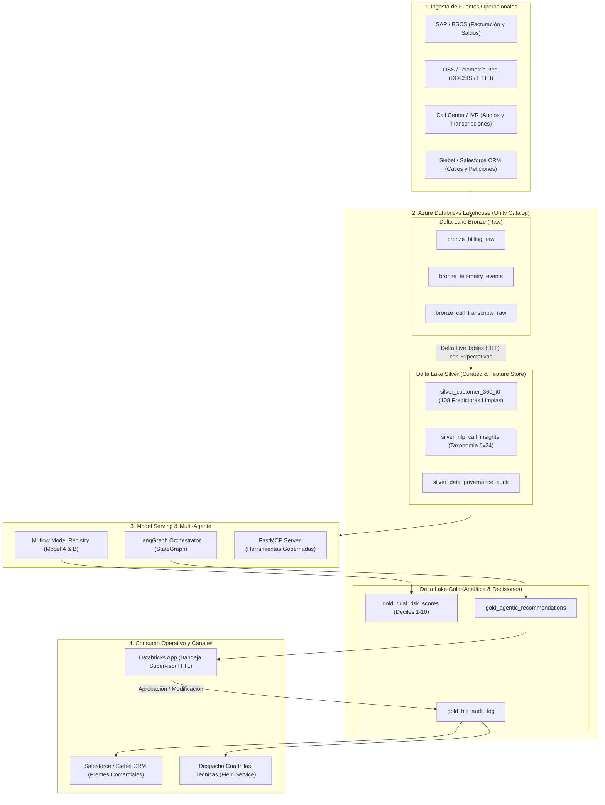

# Blueprint de Arquitectura Empresarial: Industrialización en Azure Databricks
**Solución**: Plataforma de Orquestación Multi-Agente y Modelado Dual para Retención de Clientes Hogar  
**Compañía**: Claro Colombia — Gerencia de Analítica Avanzada  
**Candidato**: Neydher Antonio Martin Ramos  
**Fecha**: Septiembre 2026  

---

## 1. Visión General de la Arquitectura

Para llevar la solución desde el prototipo analítico hasta una operación industrial capaz de procesar **millones de abonados masivos** en Claro Colombia, se diseña este **Enterprise Blueprint** basado en el **Lakehouse de Azure Databricks**.

La arquitectura articula:
1. **Delta Lake (Arquitectura Medallion)** para ingesta y curaduría de datos transaccionales, de red y voz.
2. **Unity Catalog** para gobierno unificado, linaje de extremo a extremo y control de acceso RBAC/ABAC.
3. **MLflow Model Registry** para versionado, firmas estrictas y despliegue del modelo dual.
4. **Databricks Workflows (DAGs)** para la orquestación distribuida de micro-lotes diarios.
5. **Databricks Apps / FastMCP Serving** para la interacción en tiempo real del sistema multi-agente con agentes humanos (HITL).
6. **Lakehouse Monitoring** para observabilidad de Data Drift, Concept Drift y métricas de agentes.



---

## 2. Arquitectura Medallion (Delta Lake)

### 2.1. Capa Bronze (Raw Ingestion)
- **Patrón de Ingesta**: Streaming distribuido y micro-lotes diarios vía **Databricks Auto Loader (`cloudFiles`)**.
- **Tablas**:
  - `claro_lakehouse.bronze.billing_raw`: Registros crudos de facturación procedentes de BSCS/SAP.
  - `claro_lakehouse.bronze.network_telemetry`: Telemetría de cablemódems y ONTs (SNR, potencia óptica Rx/Tx, eventos de reinicio, microcortes).
  - `claro_lakehouse.bronze.call_transcripts`: Transcripciones de audio provenientes del sistema de Speech-to-Text de Genesys/Avaya.
- **Formato**: Delta Lake en modo *Append-Only*, con esquema evolutivo habilitado (`mergeSchema = true`).

### 2.2. Capa Silver (Feature Store & Auditoría T0)
- **Transformación**: Pipelines declarativos con **Delta Live Tables (DLT)** garantizando controles de calidad de datos mediante `EXPECT` y `ON VIOLATION DROP ROW`.
- **Blindaje Estricto contra Fuga de Información ($T_0$)**:
  - Exclusión verificada por esquema de variables post-tratamiento (`ESTADO_FUENTE_C`, `VAL_SALDO_ACTUAL`, `BAN_OT_CERRADAS_DX`).
  - Tabla `silver_customer_360_t0`: Contiene las **108 variables predictoras validadas**.
  - Tabla `silver_nlp_call_insights`: Contiene las entidades, motivos (`FALLA_TECNICA`, `FACTURACION`, etc.) y evidencia textual estructurada bajo el contrato Pydantic.
- **Integración con Databricks Feature Store**: Registrado como catálogo oficial para entrenamiento reproducible e inferencia por lotes y tiempo real.

### 2.3. Capa Gold (Inferencia y Decisiones de Negocio)
- **Tablas de Salida**:
  - `claro_lakehouse.gold.customer_risk_scores`: Puntuaciones de Churn Efectivo (Modelo A), Intención de Cancelación (Modelo B), deciles poblacionales y clasificación de patrones (`SILENT_CHURN_PATTERN`, `CRITICAL_BOTH`, `LOW`).
  - `claro_lakehouse.gold.retention_actions`: Acción recomendada, impacto económico en ARPU, desglose de costos y estado del Human-in-the-Loop.
  - `claro_lakehouse.gold.hitl_decision_audit`: Bitácora inmutable de revisiones de supervisores humanos.

---

## 3. MLflow Model Registry & Gobernanza MLOps

### 3.1. Versionado y Registro de Modelos
Ambos modelos son registrados en el **Unity Catalog Model Registry** con firmas estrictas (*Model Signatures*):

```python
import mlflow
from mlflow.models import infer_signature

# Registro de Modelo A (Churn Efectivo)
signature_a = infer_signature(X_dev[predictors], y_dev_churn)
mlflow.lightgbm.log_model(
    lgb_model=final_model_a,
    artifact_path="model_a_churn",
    signature=signature_a,
    registered_model_name="claro_lakehouse.retention.model_a_churn",
    metadata={
        "features_count": 108,
        "holdout_pr_auc": 0.4738,
        "holdout_lift_10": 9.048,
        "leakage_t0_audit_passed": "True",
        "evaluator": "Rafael Del Castillo"
    }
)
```

### 3.2. Criterios Automatizados de Promoción a Producción
Para promover un modelo de `Staging` a `Champion / Production`:
1. **Validación de Fuga T0**: Verificación automatizada de que ninguna variable clasificada como `TARGET_LEAKAGE` o `POST_TREATMENT` forme parte del signature del modelo.
2. **Umbral de Calidad Predictiva**:
   - Modelo A: PR-AUC en Holdout $\ge 0.40$ y Lift@10 $\ge 8.0x$.
   - Modelo B: PR-AUC en Holdout $\ge 0.60$ y Lift@10 $\ge 3.5x$.
3. **Prueba de Inferencia Silenciosa (Shadow Scoring)**: Ejecución en paralelo durante 14 días comparando estabilidad de predicciones frente al modelo previo.

---

## 4. Orquestación Multi-Agente y Human-in-the-Loop (HITL)

### 4.1. Despliegue de LangGraph en Databricks
El grafo de agentes se orquesta en un contenedor escalable utilizando **Databricks Model Serving / Databricks Apps**:
- **Customer Intelligence Agent**: Consume los scores y deciles calculados en Spark.
- **NLP / VoC Agent**: Procesa consultas semánticas y extrae el perfil de fricción de voz.
- **Retention Orchestrator**: Aplica la matriz de accionabilidad y el cálculo de ROI empírico.
- **Judge Agent**: Evalúa de manera determinística las restricciones de negocio.

### 4.2. Flujo de Persistencia y Checkpointing del HITL
El grafo implementa el mecanismo `interrupt()` respaldado por un checkpointer persistente en Delta Lake o Redis gestionado:
1. El nodo del orquestador detecta una condición HITL (ej. descuento $>20\%$, cliente VIP o patrón de Silent Churn).
2. El grafo emite `interrupt()` y guarda el estado serializado en `claro_lakehouse.gold.hitl_pending_tasks`.
3. Una aplicación web interna (**Databricks App** desarrollada en Streamlit/FastAPI) despliega la bandeja de casos a los supervisores de Claro.
4. El supervisor aprueba, modifica o rechaza la recomendación.
5. El sistema reanuda el grafo (`graph.invoke(Command(resume=review_payload))`), registrando la decisión final en la capa Gold y disparando la acción hacia Salesforce CRM o el sistema de despacho de cuadrillas técnicas.

---

## 5. Databricks Workflows (DAG Productivo)

El pipeline diario de retención corre de forma programada a las 02:00 AM mediante **Databricks Workflows**:

```
[Task 1: Ingest_Bronze_AutoLoader]
         │
         ▼
[Task 2: Silver_DLT_Feature_Store]
         │
         ▼
[Task 3: Spark_Dual_Model_Batch_Inference] ───► Genera Scores y Deciles
         │
         ▼
[Task 4: NLP_VoC_Enrichment_Decile_1_2]   ───► Procesa Quejas Críticas
         │
         ▼
[Task 5: LangGraph_MultiAgent_Orchestrator] ──► Evalúa Catálogo y ROI
         │
         ▼
[Task 6: Route_Decisions]
   ├── Si HITL = False ──► [Task 7A: Push_Direct_to_CRM]
   └── Si HITL = True  ──► [Task 7B: Push_to_Supervisor_App]
                                      │
                                      ▼
                           [Task 8: Reverse_ETL_Final]
```

---

## 6. Monitoreo Continuo, Deriva y Observabilidad (MLOps & LLMOps)

Para asegurar la vigencia del sistema en el tiempo, se configura **Databricks Lakehouse Monitoring**:

| Dimensión | Métrica Monitoreada | Frecuencia | Umbral de Alerta | Acción de Mitigación |
| :--- | :--- | :--- | :--- | :--- |
| **Data Drift (Datos)** | Population Stability Index (PSI) en Top Drivers SHAP (`VAL_RECLAMOS_MES`, `VELOCIDAD`, `VAL_VAR_RENTA`) | Semanal | PSI $> 0.15$ (Moderado)<br>PSI $> 0.25$ (Severo) | Reentrenamiento automático en DLT; notificación por Slack/Teams al equipo de MLOps. |
| **Concept Drift (Modelo)** | PR-AUC y Lift@10 sobre etiquetas consolidadas a $T+30$ y $T+60$ días | Mensual | Degradación $> 15\%$ vs Línea Base | Disparo de pipeline de ajuste de hiperparámetros en MLflow. |
| **Gobernanza HITL** | Tasa de casos enviados a revisión humana | Diaria | $> 25\%$ o $< 5\%$ | Calibración de umbrales del catálogo de acciones. |
| **Calidad de Decisiones** | Tasa de desacuerdo (Supervisor Override Rate) | Semanal | $> 12\%$ | Reentrenamiento de reglas del `JudgeAgent` y refinamiento de prompts. |
| **Rendimiento Agentes** | Latencia p95 de ejecución del grafo | Continua | $> 1.5$ segundos | Escalado horizontal de pods en Databricks Model Serving. |
| **Integridad de Esquema** | Errores Pydantic / FastMCP | Continua | $> 0.0\%$ | Fallback determinístico a `ABSTAIN_NO_ACTION`. |

---

## 7. Gobierno y Seguridad en Unity Catalog

1. **Privacidad de Datos y Cumplimiento Regulatorio (Ley 1581 de Habeas Data Colombia)**:
   - Máscaras dinámicas en columnas sensibles: Números de teléfono móvil, documento de identidad (Cédula) y direcciones residenciales son anonimizados mediante *Dynamic Column Masking*.
2. **Control de Acceso Basado en Roles (RBAC)**:
   - Rol `Data_Scientist`: Acceso de lectura a Silver y Feature Store.
   - Rol `Model_Engineer`: Acceso de escritura a MLflow Registry y Pipelines.
   - Rol `Retention_Supervisor`: Acceso exclusivo a la capa Gold y aplicación HITL.
3. **Linaje Completo de Datos**:
   - Rastreo automático desde la tabla transaccional BSCS/SAP en Bronze hasta la llamada de API que envía la cuadrilla técnica al hogar del cliente.
