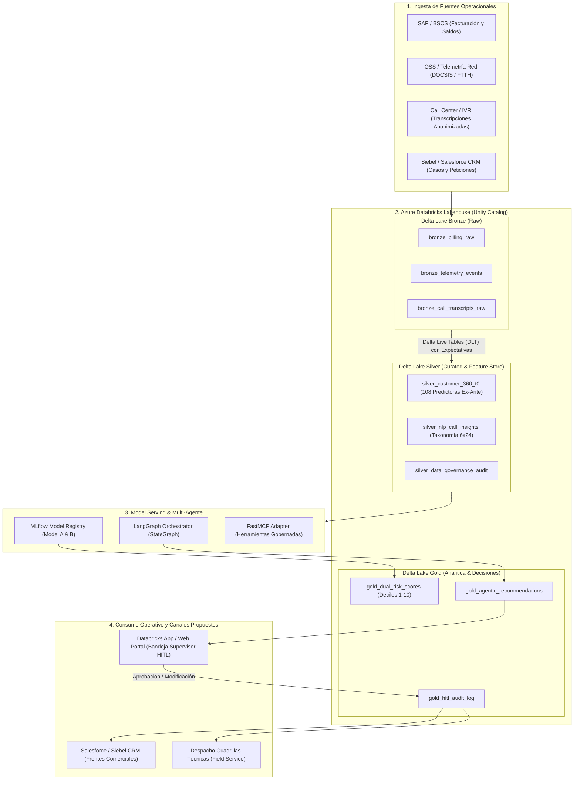

# Blueprint de Arquitectura Empresarial: Propuesta de Productivización en Azure Databricks
**Solución**: Plataforma de Orquestación Multi-Agente y Modelado Dual para Retención de Clientes Hogar  
**Compañía**: Claro Colombia — Gerencia de Analítica Avanzada  
**Candidato**: Neydher Antonio Martin Ramos  
**Fecha**: Septiembre 2026  
**Alcance**: **Blueprint Conceptual de Arquitectura y Despliegue** (No requiere despliegue productivo en infraestructura física en esta fase)  

---

## 1. Visión General de la Arquitectura Propuesta

Para llevar la solución desde el prototipo funcional verificado localmente hacia una operación industrial a escala en Claro Colombia, se propone este **Blueprint Conceptual** basado en el **Lakehouse de Azure Databricks**.

La arquitectura articula:
1. **Delta Lake (Arquitectura Medallion)** para ingesta y curaduría de datos transaccionales, de red y voz.
2. **Unity Catalog** para gobierno centralizado, linaje de datos y control de acceso granular.
3. **MLflow Model Registry** para versionado formal, firmas tipadas y seguimiento de experimentos.
4. **Databricks Workflows (DAGs)** para la orquestación distribuida por lotes.
5. **FastMCP Local / Serving Adaptable** para la interoperabilidad de herramientas gobernadas.
6. **Data Quality Monitoring / Data Profiling** (anteriormente Lakehouse Monitoring) para observabilidad de drift y calidad.



---

## 2. Arquitectura Medallion (Delta Lake)

### 2.1. Capa Bronze (Raw Ingestion)
- **Patrón de Ingesta Propuesto**: Streaming distribuido y micro-lotes vía **Databricks Auto Loader (`cloudFiles`)**.
- **Tablas**:
  - `claro_lakehouse.bronze.billing_raw`: Registros crudos de facturación procedentes de BSCS/SAP con metadata de auditoría (`batch_id`, hash de fuente).
  - `claro_lakehouse.bronze.network_telemetry`: Telemetría de cablemódems y ONTs (SNR, potencia óptica, eventos de reinicio).
  - `claro_lakehouse.bronze.call_transcripts`: Transcripciones anonimizadas de llamadas.
- **Formato**: Delta Lake en modo *Append-Only*, con esquema evolutivo habilitado (`mergeSchema = true`).

### 2.2. Capa Silver (Feature Store & Auditoría T0)
- **Transformación**: Pipelines declarativos con **Delta Live Tables (DLT)** garantizando controles de calidad de datos mediante `EXPECT` y reglas de integridad.
- **Blindaje Estricto contra Fuga de Información ($T_0$)**:
  - Exclusión verificada por esquema de variables post-tratamiento (`ESTADO_FUENTE_C`, `VAL_SALDO_ACTUAL`, `BAN_OT_CERRADAS_DX`).
  - Tabla `silver_customer_360_t0`: Contiene las **108 variables predictoras validadas ex-ante**.
  - Tabla `silver_nlp_call_insights`: Contiene las entidades, motivos (`FALLA_TECNICA`, `PRECIO_Y_COMPETENCIA`, etc.) y evidencia textual estructurada bajo contrato Pydantic.
- **Integración con Databricks Feature Store**: Catálogo oficial para inferencia batch reproducible.

### 2.3. Capa Gold (Inferencia y Decisiones de Negocio)
- **Tablas de Salida**:
  - `claro_lakehouse.gold.customer_risk_scores`: Puntuaciones de Churn Efectivo (Modelo A), Intención de Cancelación (Modelo B), deciles poblacionales y clasificación de patrones (`SILENT_CHURN_PATTERN`, `CRITICAL_BOTH`, `LOW`).
  - `claro_lakehouse.gold.retention_actions`: Acción recomendada, impacto económico estimado en ARPU, desglose de costos y estado del Human-in-the-Loop.
  - `claro_lakehouse.gold.hitl_decision_audit`: Bitácora inmutable de revisiones de supervisores humanos.

---

## 3. MLflow Model Registry & Gobernanza MLOps

### 3.1. Versionado y Registro de Modelos
Ambos modelos se registran en el **Unity Catalog Model Registry** con firmas estrictas (*Model Signatures*):

```python
import mlflow
from mlflow.models import infer_signature

# Registro de Modelo A (Churn Efectivo)
signature_a = infer_signature(X_dev[predictors], y_dev_churn)
mlflow.lightgbm.log_model(
    lgb_model=final_model_a,
    artifact_path="model_a_churn",
    signature=signature_a,
    registered_model_name="claro_lakehouse.retention.model_a_churn",
    metadata={
        "features_count": 108,
        "holdout_pr_auc": 0.4738,
        "holdout_lift_10": 9.048,
        "leakage_t0_audit_passed": "True",
        "redteam_permutation_passed": "True"
    }
)
```

### 3.2. Criterios de Promoción a Producción
Para promover un modelo de `Staging` a `Champion / Production`:
1. **Validación de Fuga T0**: Verificación automatizada de que ninguna variable post-tratamiento o proxy forme parte del signature del modelo.
2. **Umbral de Calidad Predictiva**:
   - Modelo A: PR-AUC en Holdout $\ge 0.40$ y Lift@10 $\ge 8.0x$.
   - Modelo B: PR-AUC en Holdout $\ge 0.60$ y Lift@10 $\ge 3.5x$.
3. **Prueba de Inferencia Silenciosa (Shadow Scoring)**: Evaluación en paralelo comparando estabilidad de predicciones frente al modelo previo.

---

## 4. Orquestación Multi-Agente y Human-in-the-Loop (HITL)

### 4.1. Despliegue Conceptual de LangGraph
El grafo de agentes se orquesta en un contenedor escalable utilizando **Databricks Model Serving / Apps**:
- **Customer Intelligence Agent**: Consume los scores y deciles calculados en Spark.
- **NLP / VoC Agent**: Procesa consultas semánticas y extrae el perfil de fricción a nivel clúster y arquetipos.
- **Retention Orchestrator**: Aplica la matriz de accionabilidad y el cálculo de ROI con tasa empírica por decil.
- **Judge Agent**: Evalúa de manera determinística las restricciones de negocio.

### 4.2. Flujo de Persistencia y Checkpointing del HITL
El grafo implementa el mecanismo `interrupt()` respaldado por un checkpointer persistente:
1. El nodo del orquestador detecta una condición HITL (descuento, cliente VIP o patrón de Silent Churn).
2. El grafo emite `interrupt()` y guarda el estado serializado en `gold.hitl_pending_tasks`.
3. Una aplicación web interna (**Databricks App** desarrollada en Streamlit/FastAPI) despliega la bandeja de casos a los supervisores de Claro.
4. El supervisor aprueba, modifica o rechaza la recomendación.
5. El sistema reanuda el grafo (`graph.invoke(Command(resume=review_payload))`), registrando la decisión final en la capa Gold y disparando la acción hacia Salesforce CRM o el sistema de despacho técnico.

---

## 5. Databricks Workflows (Ejemplo de DAG Productivo Propuesto)

Configuración de referencia programada (ej. a las 02:00 AM) mediante **Databricks Workflows**:

```
[Task 1: Ingest_Bronze_AutoLoader]
         │
         ▼
[Task 2: Silver_DLT_Feature_Store]
         │
         ▼
[Task 3: Spark_Dual_Model_Batch_Inference] ───► Genera Scores y Deciles
         │
         ▼
[Task 4: NLP_VoC_Enrichment_Decile_1_2]   ───► Procesa Quejas Críticas
         │
         ▼
[Task 5: LangGraph_MultiAgent_Orchestrator] ──► Evalúa Catálogo y ROI
         │
         ▼
[Task 6: Route_Decisions]
   ├── Si HITL = False ──► [Task 7A: Push_Direct_to_CRM]
   └── Si HITL = True  ──► [Task 7B: Push_to_Supervisor_App]
                                      │
                                      ▼
                           [Task 8: Reverse_ETL_Final]
```

---

## 6. Monitoreo Continuo, Deriva y Observabilidad (Data Quality & MLOps)

Se propone configurar **Data Quality Monitoring / Data Profiling** (anteriormente Lakehouse Monitoring):

| Dimensión | Métrica Monitoreada | Frecuencia | Umbral Propuesto / Configurable | Acción de Mitigación |
| :--- | :--- | :--- | :--- | :--- |
| **Data Drift (Datos)** | Population Stability Index (PSI) en drivers SHAP clave (`VAL_RECLAMOS_MES`, `VELOCIDAD`, `VAL_VAR_RENTA`) | Semanal | $\text{PSI} > 0.15$ (Configurable) | Pipeline de análisis de deriva en DLT; alerta al equipo de MLOps. |
| **Concept Drift (Modelo)** | PR-AUC y Lift@10 sobre etiquetas consolidadas a $T+30$ y $T+60$ días | Mensual | Degradación $> 15\%$ vs Línea Base | Disparo de pipeline de reentrenamiento en MLflow. |
| **Gobernanza HITL** | Tasa de casos enviados a revisión humana | Diaria | Monitoreo de rango (10% - 25%) | Calibración de umbrales del catálogo de acciones. |
| **Calidad de Decisiones** | Tasa de desacuerdo (Supervisor Override Rate) | Semanal | Monitoreo de desvíos (> 12%) | Ajuste de reglas del `JudgeAgent`. |
| **Rendimiento Agentes** | Latencia p95 de ejecución del grafo | Continua | Alerta preventiva si $> 1.5$ s | Escalado de recursos en Model Serving. |
| **Integridad de Esquema** | Errores Pydantic / FastMCP | Continua | Tolerancia 0.0% | Fallback determinístico a `ABSTAIN_NO_ACTION`. |

---

## 7. Gobierno y Privacidad en Unity Catalog

1. **Protección de Datos Personales (Colombia)**:
   - Diseño compatible con principios de protección de datos personales y controles de gobierno aplicables en Colombia (Ley 1581 de 2012), sujeto a validación final de Legal y Compliance.
   - Enmascaramiento dinámico de datos (*Dynamic Column Masking*) sobre identificadores y datos de contacto en vistas analíticas.
2. **Control de Acceso Basado en Roles (RBAC)**:
   - Separación estricta de permisos: Data Scientists (Silver/Feature Store), MLOps Engineers (Model Registry), y Supervisores de Retención (Gold/HITL App).
3. **Linaje Completo de Datos**:
   - Trazabilidad auditable desde las fuentes operacionales en Bronze hasta la recomendación final aprobada por el supervisor humano.
